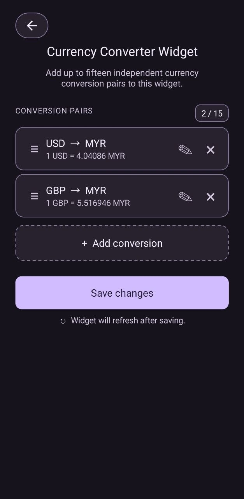
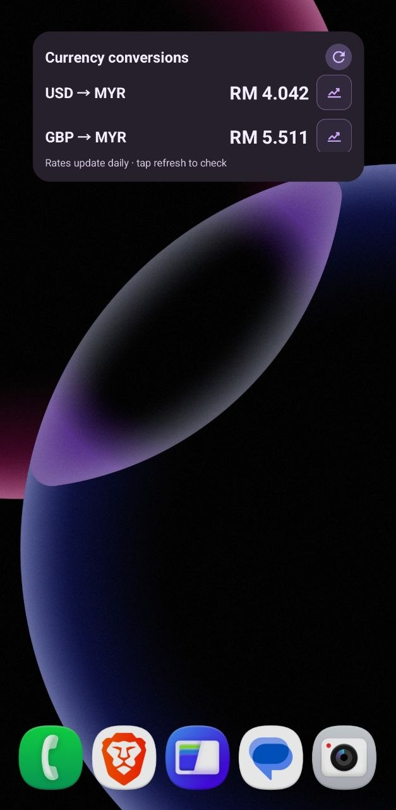

# Currency Converter Widget

A small native Android home-screen widget for showing up to fifteen independent currency conversion pairs in one widget instance.

## Features

- Add, edit, remove, and reorder up to fifteen conversion pairs
- Choose the base currency first and the target currency second for every new conversion
- Mix different base currencies in the same widget
- Search currencies by name or code
- Tap the widget to configure it, tap an individual conversion row to edit that pair, tap the graph button to open Google's chart search for that pair, or tap the refresh button to update rates
- Configure either the no-key daily ExchangeRate-API feed or the more frequently updated fxRatesAPI feed
- Store an fxRatesAPI key locally using Android Keystore-backed encryption
- See the latest rate, update time, and cached values when offline
- Follow the system's light or dark mode and resize the widget on the home screen

## How it works

Each widget stores up to fifteen ordered pairs, such as:

- US Dollar → Malaysian Ringgit
- British Pound → Euro
- Singapore Dollar → Japanese Yen

The configuration screen keeps each pair independent, so a second base currency does not require another widget instance. Existing configurations are migrated automatically: the old one-base/multiple-target format becomes multiple pairs that share the saved base. Rates are cached using both currencies, preventing values from different bases from being mixed.

Tap the widget body to open its conversion-pair list. The **Rate provider settings** entry opens the provider and API-key screen. Tapping an individual conversion row opens that pair's edit screen directly. Tapping the graph icon opens a Google search for the pair, such as `USD MYR`, where Google can display its conversion chart. The **refresh button** fetches the latest rates. When all configured rows do not fit in the widget's current height, the conversion list can be scrolled. Rates are updated automatically according to the selected provider, and the last saved value remains visible if a refresh cannot reach the service.

### Screenshots

## Rate data source

The widget supports two rate providers, selected from the configuration screen:

- **ExchangeRate-API Open Access** is the default no-key option with a daily public dataset.
- **fxRatesAPI** is an optional authenticated feed with more frequent updates according to the account plan.

Both providers return rates from the selected base currency. The widget caches successful values locally for offline display. Availability, limits, accuracy, and terms are controlled by the upstream provider.

## Build and release

Build and release workflows are documented separately:

- [Building and QA](docs/BUILDING.md)
- [Production release](docs/RELEASING.md)

## Install

Download the APK from the [published releases](../../releases), copy it to a location visible to Android Files, open it, and approve installation if Android asks. After installation, add **Currency Converter Widget** from the home-screen widget picker.

## Refresh behavior

The ExchangeRate-API Open Access endpoint updates once per day, so the widget checks it hourly while Android may defer background work under battery-saving policies. fxRatesAPI refreshes according to the selected account plan. The refresh button remains available for manual checks, and the last successful value remains visible when a request fails.
