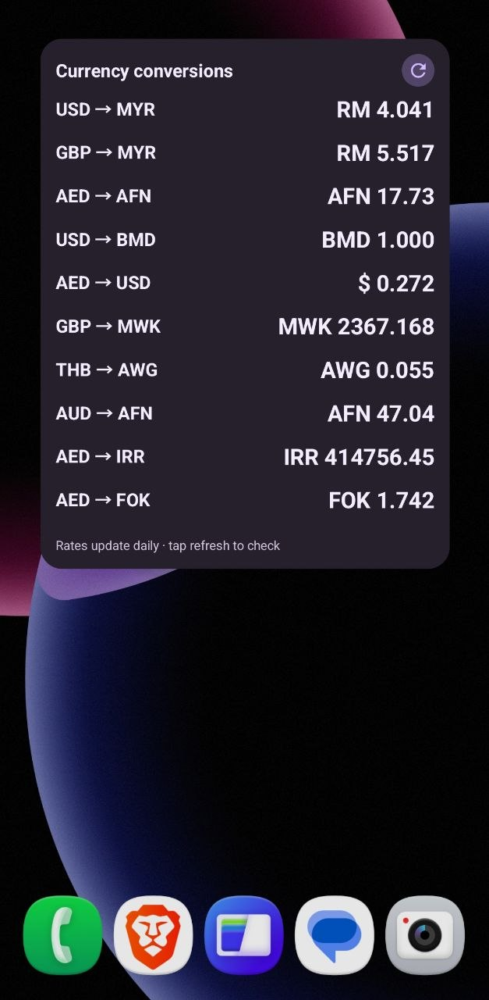

# Currency Converter Widget

A small native Android home-screen widget for comparing exchange rates across independent widget instances.

## Features

- Choose a base currency and the currencies you want to compare it with
- Add multiple widgets, each with its own independent base currency
- Search currencies by name or code
- Tap the gear button to change a widget, or the refresh button to update it
- See the latest rate, update time, and cached values when offline
- Follow the system's light or dark mode and resize the widget on the home screen

## How it works

Each widget compares one base currency against up to five target currencies. Widgets are independent, so you can place several on the home screen with different bases.

For example, the screenshot below shows three widgets comparing different bases against Malaysian Ringgit:

- US Dollar → Malaysian Ringgit
- British Pound → Malaysian Ringgit
- Singapore Dollar → Malaysian Ringgit

The **gear button** opens that widget's settings. The **refresh button** fetches the latest rate. Rates are updated automatically from time to time, and the last saved value remains visible if a refresh cannot reach the service.

## Rate data source

Rates are fetched from [ExchangeRate-API's open endpoint](https://www.exchangerate-api.com/docs/free) using this URL pattern:

```text
https://open.er-api.com/v6/latest/{BASE_CURRENCY}
```

The open endpoint does not require an API key. The widget requests the selected base currency, reads the target currencies from the response, and caches the last successful values locally for offline display. Availability, limits, and terms are controlled by the upstream provider.



## Build

The project uses a small native Android build script. The required tools are:

- Java Development Kit 8 or newer
- Android SDK platform `android-33` containing `android.jar`
- Android Asset Packaging Tool 2 (`aapt2`)
- D8
- APK Signer
- Zip

Set `ANDROID_SDK_ROOT` or update the SDK path in `build.sh` if the Android SDK is not under `~/android-sdk`.

If the Android framework resource package is not at `/system/framework/framework-res.apk`, set `ANDROID_FRAMEWORK_RES` to its location before building.

```sh
./build.sh
```

The signed APK is written to:

```text
build/Currency-Converter-Widget.apk
```

The build also verifies the APK signature. Generated build output and signing keys are intentionally ignored by Git.

## Termux build notes

This project was built through Hermes using Termux on Android. On Termux, install the required command-line tools using the platform's package manager, keep the official Android platform stub outside the repository, and run the same `./build.sh` command.

The repository does not require Termux at runtime or as a product dependency; these notes only document one supported native build environment.

## Install

Download the APK from the [published releases](../../releases), copy it to a location visible to Android Files, open it, and approve installation if Android asks. After installation, add **Currency Converter Widget** from the home-screen widget picker.

## Refresh behavior

Android may delay background work under battery-saving policies, so the 30-minute interval is an intended cadence rather than a hard real-time guarantee. Manual refresh remains available from each widget.
