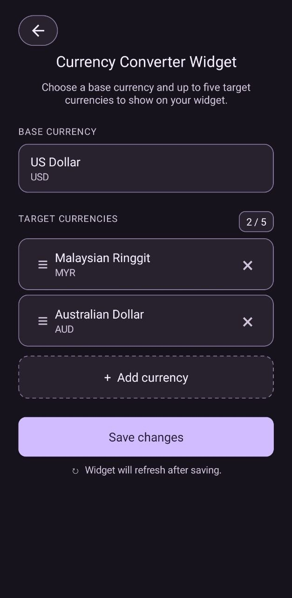

# Currency Converter Widget

A small native Android home-screen widget for showing up to fifteen independent currency conversion pairs in one widget instance.

## Features

- Add, edit, remove, and reorder up to fifteen conversion pairs
- Choose the base currency first and the target currency second for every new conversion
- Mix different base currencies in the same widget
- Search currencies by name or code
- Tap the widget to configure it, tap an individual conversion row to edit that pair, or tap the refresh button to update rates
- See the latest rate, update time, and cached values when offline
- Follow the system's light or dark mode and resize the widget on the home screen

## How it works

Each widget stores up to fifteen ordered pairs, such as:

- US Dollar → Malaysian Ringgit
- British Pound → Euro
- Singapore Dollar → Japanese Yen

The configuration screen keeps each pair independent, so a second base currency does not require another widget instance. Existing configurations are migrated automatically: the old one-base/multiple-target format becomes multiple pairs that share the saved base. Rates are cached using both currencies, preventing values from different bases from being mixed.

Tap the widget body to open its conversion-pair list. Tapping an individual row opens that pair's edit screen directly. The **refresh button** fetches the latest rates. When all configured rows do not fit in the widget's current height, the conversion list can be scrolled. Rates are updated automatically from time to time, and the last saved value remains visible if a refresh cannot reach the service.

### Screenshots




## Rate data source

Rates are fetched from [ExchangeRate-API's open endpoint](https://www.exchangerate-api.com/docs/free) using this URL pattern:

```text
https://open.er-api.com/v6/latest/{BASE_CURRENCY}
```

The open endpoint does not require an API key. The widget groups pairs with the same base into one request, reads each target from that response, and caches the last successful values locally for offline display. Availability, limits, and terms are controlled by the upstream provider.

## Build

The project uses a small native Android build script. The required tools are:

- Java Development Kit 8 or newer
- Android SDK platform `android-33` containing `android.jar`
- Android Asset Packaging Tool 2 (`aapt2`)
- D8
- APK Signer
- Zip

Set `ANDROID_SDK_ROOT` or update the SDK path in `build.sh` if the Android SDK is not under `~/android-sdk`.

If the Android framework resource package is not at `/system/framework/framework-res.apk`, set `ANDROID_FRAMEWORK_RES` to its location before building.

```sh
./build.sh
```

The signed APK is written to `build/Currency-Converter-Widget.apk`. The build also verifies the APK signature. Generated build output and signing keys are intentionally ignored by Git.

## Install

Download the APK from the [published releases](../../releases), copy it to a location visible to Android Files, open it, and approve installation if Android asks. After installation, add **Currency Converter Widget** from the home-screen widget picker.

## Refresh behavior

The open endpoint updates its rates once per day, but the widget checks periodically so a refresh window is unlikely to be missed. Automatic checks run every hour; the refresh button remains available when you want to check manually. Android may still delay background work under battery-saving policies, and repeated requests return the provider's cached daily dataset.
